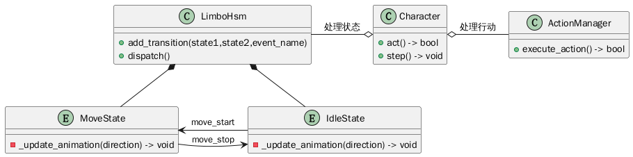
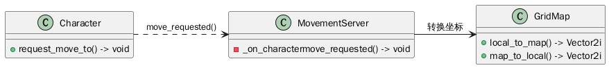

#+TITLE: 程序架构 - Character

* 结构图
#+begin_src plantuml :file character_struct.png
class Character{
+ act() -> bool
+ step() -> void
}

class ActionManager{
+ execute_action() -> bool
}

class LimboHsm{
+ add_transition(state1,state2,event_name)
+ dispatch()
}
entity IdleState{
- _update_animation(direction) -> void
}
entity MoveState{
- _update_animation(direction) -> void
}

Character o-right- ActionManager : 处理行动
Character o-left- LimboHsm : 处理状态
IdleState -up-* LimboHsm
MoveState -up-* LimboHsm
IdleState -left-> MoveState : move_start
MoveState -right-> IdleState : move_stop
#+end_src

#+RESULTS:

* 关系图
#+begin_src plantuml :file character_relation.png
class Character{
+ request_move_to() -> void
}
class MovementServer{
- _on_charactermove_requested() -> void
}
class GridMap{
+ local_to_map() -> Vector2i
+ map_to_local() -> Vector2i
}
Character .right.> MovementServer : move_requested()
MovementServer -right-> GridMap : 转换坐标
#+end_src

#+RESULTS:

