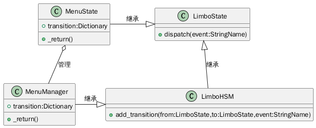

#+TITLE: 程序架构 - MenuManager

* 介绍
菜单管理器架构，负责管理JRPG菜单状态的基类，继承LimboHSM。

* 关系图
#+begin_src plantuml :file menu_manager_struct.png
class LimboHSM{
+ add_transition(from:LimboState,to:LimboState,event:StringName)
}
class LimboState{
+ dispatch(event:StringName)
}
class MenuManager{
+ transition:Dictionary
+ _return()
}
class MenuState{
+ transition:Dictionary
+ _return()
}
LimboHSM -up-|> LimboState : 继承
MenuManager -right-|> LimboHSM : 继承
MenuState -right-|> LimboState : 继承
MenuState o-- MenuManager : 管理
#+end_src

#+ATTR_ORG: :width 340
#+RESULTS:

