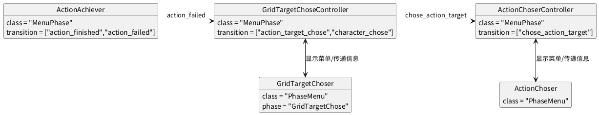

#+TITLE: 菜单系统

* MenuPhase与PhaseMenu
MenuPhase是带有简单的return事件的phase，该phase通过方法_return来处理return事件。
PhaseMenu则是会自动根据phase阶段来显示的菜单，它默认会监听对应的Phase，在Phase阶段进入后自动显示菜单，Phase阶段退出时自动隐藏菜单。

* ActionChoseMenu结构
#+begin_src plantuml :file action_chose_menu_struct.png
object GridTargetChoseController {
  class = "MenuPhase"
  transition = ["action_target_chose","character_chose"]
}
  
object ActionChoserController { 
  class = "MenuPhase"
  transition = ["chose_action_target"]
}

object ActionAchiever {
  class = "MenuPhase"
  transition = ["action_finished","action_failed"]
}

object GridTargetChoser {
  class = "PhaseMenu"
  phase = "GridTargetChose"
}

object ActionChoser {
  class = "PhaseMenu"
}

GridTargetChoseController <-down-> GridTargetChoser :显示菜单/传递信息
ActionChoserController <-down-> ActionChoser:显示菜单/传递信息
GridTargetChoseController -> ActionChoserController:chose_action_target
ActionAchiever -> GridTargetChoseController:action_failed
#+end_src

#+RESULTS:

