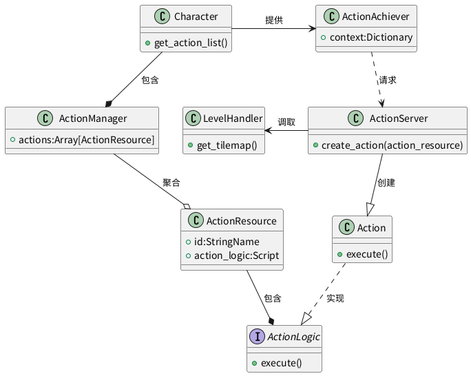

#+TITLE: 程序架构 - 行动系统

* 介绍
用来处理行动通用逻辑的类，也提供行动属性、限制等访问逻辑。

* 关系图
#+begin_src plantuml :file action_struct.png
class Character{
+ get_action_list()
}
class Action{
+ execute()
}
class ActionManager{
+ actions:Array[ActionResource]
}
class ActionResource{
+ id:StringName
+ action_logic:Script
}
class ActionServer{
+ create_action(action_resource)
}
class LevelHandler{
+ get_tilemap()
}
class ActionAchiever{
+ context:Dictionary
}
interface ActionLogic{
+ execute()
}

ActionAchiever ..> ActionServer : 请求
Character -right-> ActionAchiever : 提供
Action ..|> ActionLogic : 实现
ActionServer --|> Action : 创建
ActionResource --* ActionLogic : 包含
ActionServer -left-> LevelHandler : 调取
ActionManager --o ActionResource : 聚合
Character --* ActionManager : 包含
#+end_src

#+ATTR_ORG: :width 640
#+RESULTS:

