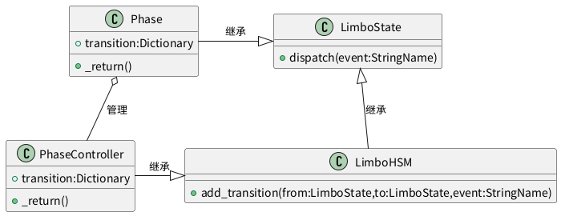

#+TITLE: 程序架构 - 阶段系统

* 介绍
阶段系统是负责处理游戏中的各个回合阶段，管理游戏进程以及传递上下文的系统，所有阶段系统的类都继承自LimboState和LimboHSM。
LimboHSM本身继承自LimboState。

* LimboState系统
LimboState的运作机制是这样的：
首先，LimboHSM其实是继承自LimboState的一个状态机类，因为继承自LimboState，因此既可以运行状态机又可以作为状态被激活。
单个LimboHSM管理的State树中，只有一个状态能被激活。
LimboHSM中是通过add_transition方法，来注册每个子状态到别的状态的转换规则的，转换方式是利用dispatch机制，dispatch到对应的转换事件后便会转换到绑定的状态。
dispatch是一个从下往上冒泡依次匹配的机制，这个机制会从状态树的最底层开始，如果最底层没有状态处理，那么就会往上冒泡，将事件传递给上级状态。因此在下级事件可以转换上级事件的状态，上级事件也可以dispatch转换下级事件的状态。
每个状态都能通过add_handler方法来注册事件的监听方法，监听方法的返回值会决定这个事件是否被消费（也就是事件是否会继续往上冒泡）。

* 上下文系统
上下文系统的运作方式非常简单。每个Phase都维护一个context字典，该context字典通常可以用信号监听是否被改变。
当该phase退出时，会自动运行一个方法将context字典传递给要转换到的phase，而PhaseController则是负责注册这些Phase的上下文转换关系的状态机。
在实际操作的过程中，因为上下文是依次传递的，因此只需要在一个Phase更改或增加上下文，在之后的Phase就能读取到该上下文，从而能够实现上下文的传递和通信。

* 阶段关系
#+begin_src plantuml :file phase_controller_struct.png
class LimboHSM{
+ add_transition(from:LimboState,to:LimboState,event:StringName)
}
class LimboState{
+ dispatch(event:StringName)
}
class PhaseController{
+ transition:Dictionary
+ _return()
}
class Phase{
+ transition:Dictionary
+ _return()
}
LimboHSM -up-|> LimboState : 继承
PhaseController -right-|> LimboHSM : 继承
Phase -right-|> LimboState : 继承
Phase o-- PhaseController : 管理
#+end_src

#+ATTR_ORG: :width 640
#+RESULTS:

